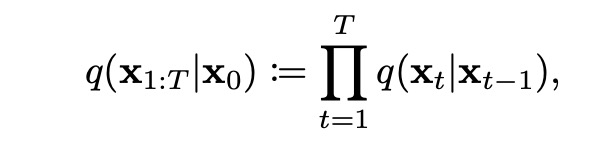
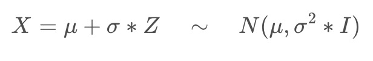
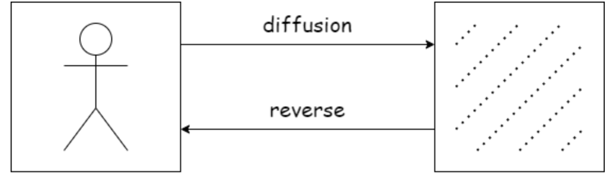
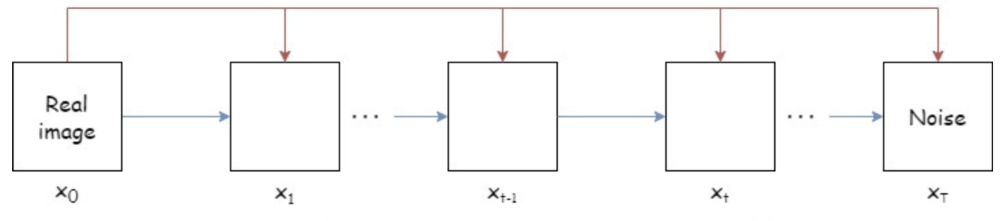
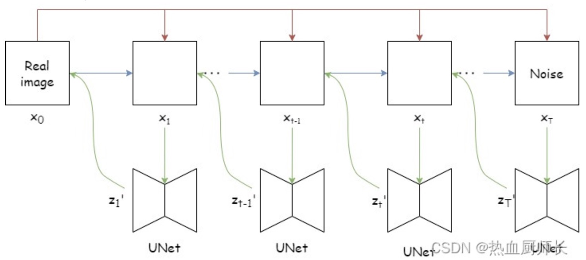
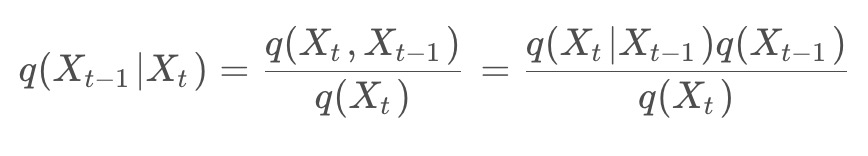
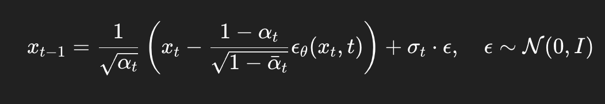
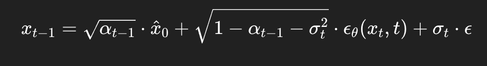
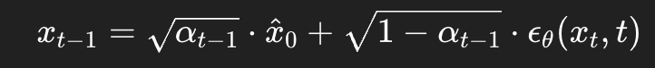

# 扩散模型项目

参考文档和项目：

* https://github.com/lucidrains/denoising-diffusion-pytorch
* https://github.com/g4vrel/CFM
* https://github.com/atong01/conditional-flow-matching?tab=readme-ov-file
* https://blog.csdn.net/weixin_42392454/article/details/137458318
* https://blog.csdn.net/weixin_42392454/article/details/137880408

```
├── .DS_Store
├── DDPM
│   ├── ddim_imgs             //ddpm生成图像文件夹
│   ├── ddimsample.py         //ddim采样，并生成每一步对x_0的可视化
│   ├── ddpm_imgs             //ddim生成图像文件夹
│   ├── denoising_diffusion_pytorch
│   ├── generate_ddim.py      //ddim采样生成脚本，生成和测试集数量一致
│   ├── generate_ddpm.py      //ddpm采样生成脚本，生成和测试集数量一致
│   ├── predict.py            //ddpm采样生成脚本
│   ├── readme.txt
│   ├── results_ddim          //ddim每一步对x_0的可视化预测图像文件夹
│   └── train.py              //训练脚本
├── Flow-matching
│   ├── README.md
│   ├── flow.py
│   ├── generate.py         //采样生成脚本
│   ├── generate_samples    //生成图像目录
│   ├── samples
│   ├── train.py
│   ├── train_new.py        //训练脚本
│   ├── unet
│   ├── utils.py
├── assets
└── readme.md
```

## DDPM原理

扩散模型中最重要的思想根基是马尔可夫链，它的一个关键性质是平稳性。即如果一个概率随时间变化，那么在马尔可夫链的作用下，它会趋向于某种平稳分布，时间越长，分布越平稳。

### 数学理论

### 1.马尔可夫链原理

**任意联合概率分布** $p(x_1, x_2, ..., x_T)$都可以写成：

$p(x_1, x_2, ..., x_T) = p(x_1) \cdot p(x_2 \mid x_1) \cdot p(x_3 \mid x_1, x_2) \cdots p(x_T \mid x_1, ..., x_{T-1})$

马尔可夫过程定义，其只与前一个时刻有关，故上述公式改为如下：

       

### 2.重参数化过程

这里补充说明一下，重参数的过程，假设从某个正态分布N (μ,σ2 ∗ I )采样一个X的话，它可以等价于，从一个标准正态分布N(0,I)去采样一个Z，然后利用Z去生成X：



### 原理理解（非数学）

分为 Diffusion 和 Reverse 两个阶段。其中 Diffusion 阶段通过不断地对真实图片添加噪声，最终得到一张噪声图片。而 Reverse 阶段，模型需要学习预测出一张噪声图片中的噪声部分，然后减掉该噪声部分，即：去噪。随机采样一张完全噪声图片，通过不断地去噪，最终得到一张符合现实世界图片分布的真实图片。



## 前向过程

这个阶段就是不断地给真实图片加噪声，经过T步加噪之后，噪声强度不断变大，得到一张完全为噪声地图像。


## 逆向过程

整个扩散过程可以近似看成一次加噪即变为噪声图。论文中的结论可以知道，这么做的效果比较差，图片是很模糊的，不符合逆扩散的过程，最好还是一步一步推。



流程：

1.由上图可知，需要由X<sub>t</sub>推理得到X<sub>t-1</sub>,相当于已知X<sub>t</sub>概率，去求X<sub>t-1</sub>的条件概率

* 

## DDIM原理

主要思想：用 **一个非马尔可夫的确定性过程** 替代原来逐步采样的马尔可夫链，从而可以跳过中间很多步骤。

### DDPM结论及DDIM优化变换

DDPM的重要结论：



DDPM采样的重要特点：

* 每一步都是一个**高斯采样**（采样一个新的随机噪声）
* 是**马尔可夫链**：你只能从 $x_t$ 推出 $x_{t-1}$，一步一步走
* 每一步都重新引入随机性 → 抽样慢、波动大

DDIM优化后的结论：



当参数σ_t 设置为0时，随机噪声这一项就会消失，从而得到一个**确定性函数**：



即使 DDIM 采样是确定性的，但每一步仍然对应一段“图像演化轨迹”。这条轨迹不是线性的，不是一步能跳完的，所以必须沿着这条轨迹分多步前进，才能接近真实图像分布。

## 项目复现

### 1.环境配置

````
# 除torch之外的一些库的配置
pip install opencv-python
pip install lmdb    #数据预处理需要
pip install einops
pip install ema_pytorch    # ddpm 需要
pip install accelerate
pip install torchdiffeq    # Flow matching需要
pip install pytorch-fid    # 计算fid指标需要
````

### 2.数据预处理

从github下载data读取的python代码：https://github.com/fyu/lsun，然后在anaconda下运行代码：
以下是相对路径形式：

```python
python data.py export ./data --out_dir ./lsun/cat --flat
```

注意这里的路径./data表示data文件夹下面包含data.mdb和lock.mdb两个文件
以下是绝对路径形式：

```python
python data.py export F:/大三春季学期/church_val --out_dir F:/大三春季学期/data/church_val --flat
```

表示F盘有文件夹LSUN，LSUN文件夹下面有cat文件夹，这里是存储的文件；要输出到F盘下面的data文件夹下面的cat文件夹。此时data.py放在F盘根目录。

### 3.模型训练

#### 2.1DDPM&DDIM

训练模型：

```python
python train.py  #具体参数在脚本中修改
```

DDPM采样生成图像：
```python
python predict.py
```

DDPM采样生成和测试集数量相同的图像文件夹：

```python
python generate_ddpm.py   #具体图像数量
```

DDIM采样生成和测试集数量相同的图像文件夹：

```python
python generate_ddim.py  #具体图像数量
```

DDIM采样生成，并可视化每一步对无噪图像x_0的预测：
```python
python ddimsample.py
```

#### 2.2Flow matching

训练模型：

```python
python train_new.py  #具体参数在脚本中修改
```

采样生成：

```python
python generate.py  #具体参数在脚本中修改
```

权重目录：Flow-matching/result

### 3.模型验证

#### 3.1FID指标计算

流程使用生成的图像文件夹和测试集图像文件夹，并利用库函数计算

```
CUDA_VISIBLE_DEVICES=0 python -m pytorch_fid /home/featurize/work/LSNU/test_resize /home/featurize/work/denoising-diffusion-pytorch/ddim_imgs/
```


